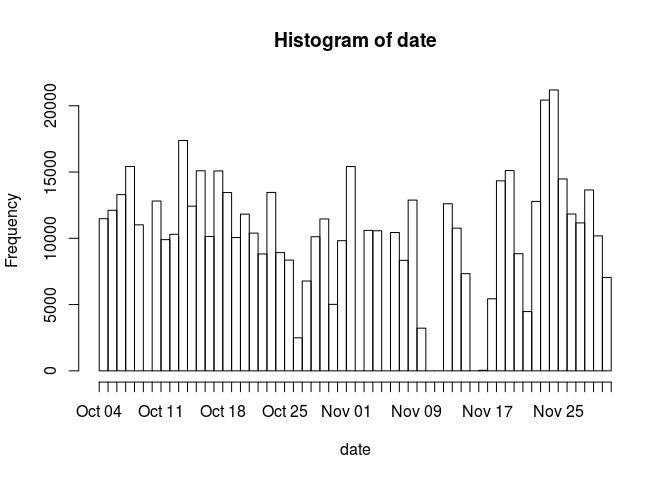
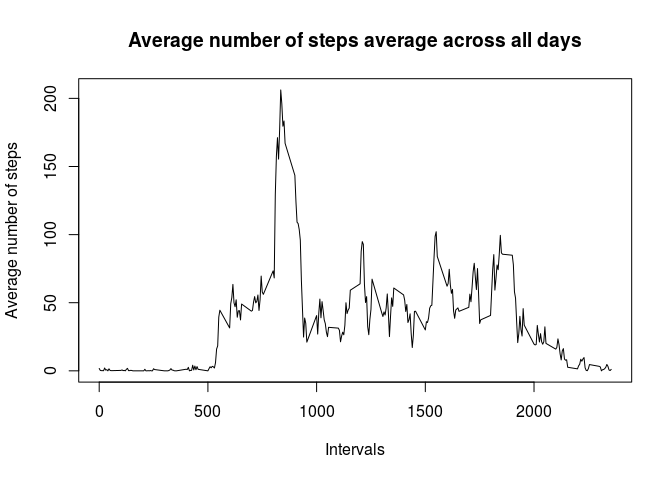
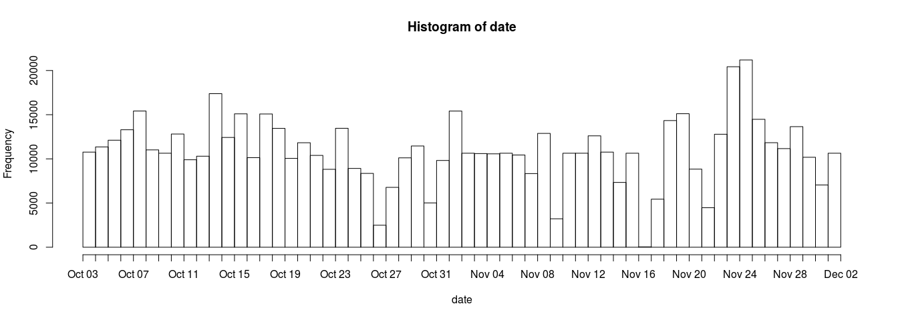
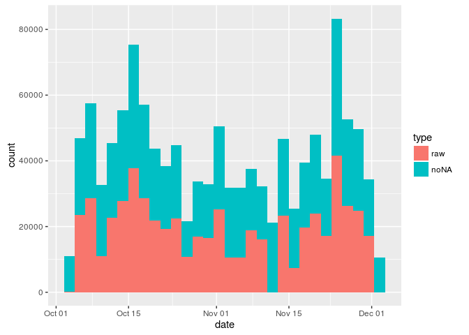
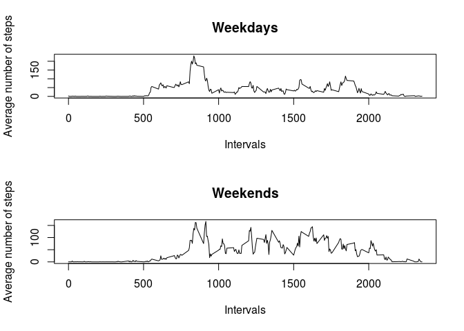

# Reproducible Research: Peer Assessment 1


## Loading and preprocessing the data

 First load the data from zipped file in folder. 

```r
 # Reading data from the same folder
 data <- read.csv(unzip("activity.zip"))  
```

Checking the data with summary 	

```r
require(stargazer)
```

```
## Loading required package: stargazer
```

```
## 
## Please cite as:
```

```
##  Hlavac, Marek (2015). stargazer: Well-Formatted Regression and Summary Statistics Tables.
```

```
##  R package version 5.2. http://CRAN.R-project.org/package=stargazer
```

```r
require(xtable)
```

```
## Loading required package: xtable
```

```r
stargazer(data,type="html")
```


<table style="text-align:center"><tr><td colspan="6" style="border-bottom: 1px solid black"></td></tr><tr><td style="text-align:left">Statistic</td><td>N</td><td>Mean</td><td>St. Dev.</td><td>Min</td><td>Max</td></tr>
<tr><td colspan="6" style="border-bottom: 1px solid black"></td></tr><tr><td style="text-align:left">steps</td><td>15,264</td><td>37.383</td><td>111.996</td><td>0</td><td>806</td></tr>
<tr><td style="text-align:left">interval</td><td>17,568</td><td>1,177.500</td><td>692.454</td><td>0</td><td>2,355</td></tr>
<tr><td colspan="6" style="border-bottom: 1px solid black"></td></tr></table>

## What is mean total number of steps taken per day?


### Calculate the total number of steps taken per day

```r
#Sum of steps taken per day   
sumSteps<-tapply(data$steps,data$date,FUN = sum,na.rm=T,simplify = T)
print(sumSteps)
```

```
## 2012-10-01 2012-10-02 2012-10-03 2012-10-04 2012-10-05 2012-10-06 
##          0        126      11352      12116      13294      15420 
## 2012-10-07 2012-10-08 2012-10-09 2012-10-10 2012-10-11 2012-10-12 
##      11015          0      12811       9900      10304      17382 
## 2012-10-13 2012-10-14 2012-10-15 2012-10-16 2012-10-17 2012-10-18 
##      12426      15098      10139      15084      13452      10056 
## 2012-10-19 2012-10-20 2012-10-21 2012-10-22 2012-10-23 2012-10-24 
##      11829      10395       8821      13460       8918       8355 
## 2012-10-25 2012-10-26 2012-10-27 2012-10-28 2012-10-29 2012-10-30 
##       2492       6778      10119      11458       5018       9819 
## 2012-10-31 2012-11-01 2012-11-02 2012-11-03 2012-11-04 2012-11-05 
##      15414          0      10600      10571          0      10439 
## 2012-11-06 2012-11-07 2012-11-08 2012-11-09 2012-11-10 2012-11-11 
##       8334      12883       3219          0          0      12608 
## 2012-11-12 2012-11-13 2012-11-14 2012-11-15 2012-11-16 2012-11-17 
##      10765       7336          0         41       5441      14339 
## 2012-11-18 2012-11-19 2012-11-20 2012-11-21 2012-11-22 2012-11-23 
##      15110       8841       4472      12787      20427      21194 
## 2012-11-24 2012-11-25 2012-11-26 2012-11-27 2012-11-28 2012-11-29 
##      14478      11834      11162      13646      10183       7047 
## 2012-11-30 
##          0
```

```r
# convert data for histogram
dd<-c()
for(i in 1:dim(data)[1]){
    if(!is.na(data[i,1]))
    dd<-c(dd,(rep(data[i,2],data[i,1])))

}
#dd<-as.Date(dd,origin="2012-10-02")
dd<-as.Date(dd, format = "%Y-%m-%d",origin="2012-10-02")
```


```r
hist(dd,breaks=60,freq=T,xlab="date")
```

<!-- -->
   

 Calculate and report the mean and median of the total number of steps taken per day. 

```r
# Calculate the mean and median total number of steps taken per day
sumSteps<-tapply(data$steps,data$date,FUN = sum,na.rm=T)
meanSteps<-tapply(data$steps,data$date,FUN = mean,na.rm=T)
medianSteps<-tapply(data$steps,data$date,FUN = median,na.rm=F)
 
resume<-data.frame(unique(data$date),sumSteps,meanSteps,medianSteps)
rownames(resume)<-1:dim(resume)[1]
colnames(resume)<-c("   date   ","   Sum   ","   mean   ","    median   ")
```


```r
stargazer(resume,type="html",summary=FALSE,
          title="Sum, mean and median total number of steps taken per day",
          rownames=FALSE)
```


<table style="text-align:center"><caption><strong>Sum, mean and median total number of steps taken per day</strong></caption>
<tr><td colspan="4" style="border-bottom: 1px solid black"></td></tr><tr><td style="text-align:left">date</td><td>Sum</td><td>mean</td><td>median</td></tr>
<tr><td colspan="4" style="border-bottom: 1px solid black"></td></tr><tr><td style="text-align:left">2012-10-01</td><td>0</td><td></td><td></td></tr>
<tr><td style="text-align:left">2012-10-02</td><td>126</td><td>0.438</td><td>0</td></tr>
<tr><td style="text-align:left">2012-10-03</td><td>11,352</td><td>39.417</td><td>0</td></tr>
<tr><td style="text-align:left">2012-10-04</td><td>12,116</td><td>42.069</td><td>0</td></tr>
<tr><td style="text-align:left">2012-10-05</td><td>13,294</td><td>46.160</td><td>0</td></tr>
<tr><td style="text-align:left">2012-10-06</td><td>15,420</td><td>53.542</td><td>0</td></tr>
<tr><td style="text-align:left">2012-10-07</td><td>11,015</td><td>38.247</td><td>0</td></tr>
<tr><td style="text-align:left">2012-10-08</td><td>0</td><td></td><td></td></tr>
<tr><td style="text-align:left">2012-10-09</td><td>12,811</td><td>44.483</td><td>0</td></tr>
<tr><td style="text-align:left">2012-10-10</td><td>9,900</td><td>34.375</td><td>0</td></tr>
<tr><td style="text-align:left">2012-10-11</td><td>10,304</td><td>35.778</td><td>0</td></tr>
<tr><td style="text-align:left">2012-10-12</td><td>17,382</td><td>60.354</td><td>0</td></tr>
<tr><td style="text-align:left">2012-10-13</td><td>12,426</td><td>43.146</td><td>0</td></tr>
<tr><td style="text-align:left">2012-10-14</td><td>15,098</td><td>52.424</td><td>0</td></tr>
<tr><td style="text-align:left">2012-10-15</td><td>10,139</td><td>35.205</td><td>0</td></tr>
<tr><td style="text-align:left">2012-10-16</td><td>15,084</td><td>52.375</td><td>0</td></tr>
<tr><td style="text-align:left">2012-10-17</td><td>13,452</td><td>46.708</td><td>0</td></tr>
<tr><td style="text-align:left">2012-10-18</td><td>10,056</td><td>34.917</td><td>0</td></tr>
<tr><td style="text-align:left">2012-10-19</td><td>11,829</td><td>41.073</td><td>0</td></tr>
<tr><td style="text-align:left">2012-10-20</td><td>10,395</td><td>36.094</td><td>0</td></tr>
<tr><td style="text-align:left">2012-10-21</td><td>8,821</td><td>30.628</td><td>0</td></tr>
<tr><td style="text-align:left">2012-10-22</td><td>13,460</td><td>46.736</td><td>0</td></tr>
<tr><td style="text-align:left">2012-10-23</td><td>8,918</td><td>30.965</td><td>0</td></tr>
<tr><td style="text-align:left">2012-10-24</td><td>8,355</td><td>29.010</td><td>0</td></tr>
<tr><td style="text-align:left">2012-10-25</td><td>2,492</td><td>8.653</td><td>0</td></tr>
<tr><td style="text-align:left">2012-10-26</td><td>6,778</td><td>23.535</td><td>0</td></tr>
<tr><td style="text-align:left">2012-10-27</td><td>10,119</td><td>35.135</td><td>0</td></tr>
<tr><td style="text-align:left">2012-10-28</td><td>11,458</td><td>39.785</td><td>0</td></tr>
<tr><td style="text-align:left">2012-10-29</td><td>5,018</td><td>17.424</td><td>0</td></tr>
<tr><td style="text-align:left">2012-10-30</td><td>9,819</td><td>34.094</td><td>0</td></tr>
<tr><td style="text-align:left">2012-10-31</td><td>15,414</td><td>53.521</td><td>0</td></tr>
<tr><td style="text-align:left">2012-11-01</td><td>0</td><td></td><td></td></tr>
<tr><td style="text-align:left">2012-11-02</td><td>10,600</td><td>36.806</td><td>0</td></tr>
<tr><td style="text-align:left">2012-11-03</td><td>10,571</td><td>36.705</td><td>0</td></tr>
<tr><td style="text-align:left">2012-11-04</td><td>0</td><td></td><td></td></tr>
<tr><td style="text-align:left">2012-11-05</td><td>10,439</td><td>36.247</td><td>0</td></tr>
<tr><td style="text-align:left">2012-11-06</td><td>8,334</td><td>28.938</td><td>0</td></tr>
<tr><td style="text-align:left">2012-11-07</td><td>12,883</td><td>44.733</td><td>0</td></tr>
<tr><td style="text-align:left">2012-11-08</td><td>3,219</td><td>11.177</td><td>0</td></tr>
<tr><td style="text-align:left">2012-11-09</td><td>0</td><td></td><td></td></tr>
<tr><td style="text-align:left">2012-11-10</td><td>0</td><td></td><td></td></tr>
<tr><td style="text-align:left">2012-11-11</td><td>12,608</td><td>43.778</td><td>0</td></tr>
<tr><td style="text-align:left">2012-11-12</td><td>10,765</td><td>37.378</td><td>0</td></tr>
<tr><td style="text-align:left">2012-11-13</td><td>7,336</td><td>25.472</td><td>0</td></tr>
<tr><td style="text-align:left">2012-11-14</td><td>0</td><td></td><td></td></tr>
<tr><td style="text-align:left">2012-11-15</td><td>41</td><td>0.142</td><td>0</td></tr>
<tr><td style="text-align:left">2012-11-16</td><td>5,441</td><td>18.892</td><td>0</td></tr>
<tr><td style="text-align:left">2012-11-17</td><td>14,339</td><td>49.788</td><td>0</td></tr>
<tr><td style="text-align:left">2012-11-18</td><td>15,110</td><td>52.465</td><td>0</td></tr>
<tr><td style="text-align:left">2012-11-19</td><td>8,841</td><td>30.698</td><td>0</td></tr>
<tr><td style="text-align:left">2012-11-20</td><td>4,472</td><td>15.528</td><td>0</td></tr>
<tr><td style="text-align:left">2012-11-21</td><td>12,787</td><td>44.399</td><td>0</td></tr>
<tr><td style="text-align:left">2012-11-22</td><td>20,427</td><td>70.927</td><td>0</td></tr>
<tr><td style="text-align:left">2012-11-23</td><td>21,194</td><td>73.590</td><td>0</td></tr>
<tr><td style="text-align:left">2012-11-24</td><td>14,478</td><td>50.271</td><td>0</td></tr>
<tr><td style="text-align:left">2012-11-25</td><td>11,834</td><td>41.090</td><td>0</td></tr>
<tr><td style="text-align:left">2012-11-26</td><td>11,162</td><td>38.757</td><td>0</td></tr>
<tr><td style="text-align:left">2012-11-27</td><td>13,646</td><td>47.382</td><td>0</td></tr>
<tr><td style="text-align:left">2012-11-28</td><td>10,183</td><td>35.358</td><td>0</td></tr>
<tr><td style="text-align:left">2012-11-29</td><td>7,047</td><td>24.469</td><td>0</td></tr>
<tr><td style="text-align:left">2012-11-30</td><td>0</td><td></td><td></td></tr>
<tr><td colspan="4" style="border-bottom: 1px solid black"></td></tr></table>

Summaries across all days


```r
sumALL<-sum(sumSteps)
meanALL<-mean(sumSteps)
medianAll<-median(sumSteps)
```
The sum of steps day is 'r sumALL'. The average of steps per day across all days is 'r meanAll' and the median The average of steps per day across all days is 'r medianALL'.	
	
	
## What is the average daily activity pattern?
   In order to answer this question. First I calculate the average number of steps taken, average per day. Second I plot the results.

1. Plot time series 

```r
meanInterval<-tapply(data$steps,data$interval,FUN = mean,na.rm=T)                                                                    
#png("figure/timeseries.png")   
plot(unique(data$interval),meanInterval,type="l",
     main="Average number of steps average across all days",
     xlab="Intervals",
     ylab="Average number of steps")
```

<!-- -->

```r
#dev.off()
```
  
2. Which 5-minute interval, on average across all the days in the dataset, contains the maximum number of steps?

```r
MaxOf<-names(which.max(meanInterval))
```
   The 835 interval contain the maximum number of steps average across all the days.


### Imputing missing values

Note that there are a number of days/intervals where there are missing
values (coded as `NA`). The presence of missing days may introduce
bias into some calculations or summaries of the data.

1. Calculate and report the total number of missing values in the dataset (i.e. the total number of rows with `NA`s)


```r
n.na<-colSums(is.na(data))
```
 The number of NAs is 2304, 0, 0.  
2. Devise a strategy for filling in all of the missing values in the dataset. The strategy does not need to be sophisticated. For example, you could use the mean/median for that day, or the mean for that 5-minute interval, etc.

I choose to use mean of interval for all days. If number of steps in NA in given row I look the interval, search for mean for that interval and replace the NA to mean. 


3. Create a new dataset that is equal to the original dataset but with the missing data filled in.
   The new dataset I call "data.noNA"
 
 ```r
 data.noNA<-data         
 for(i in 1:dim(data)[1]){  
    # Check for NA  
    if(is.na(data.noNA[i,1])){  
        # look the mean and replace  
        meanA<-meanInterval[as.character(data.noNA[i,3])]          
        data.noNA[i,1]<-meanA  
    }
 }
 ```

4. Make a histogram of the total number of steps taken each day and Calculate and report the **mean** and **median** total number of steps taken per day. Do these values differ from the estimates from the first part of the assignment? What is the impact of imputing missing data on the estimates of the total daily number of steps?

First, histogram

```r
#Sum of steps taken per day   
#sumSteps<-tapply(data$steps,data$date,FUN = sum,na.rm=T,simplify = T)
#print(sumSteps)


# convert data for histogram
dd.NA<-c()
for(i in 1:dim(data.noNA)[1]){
    if(!is.na(data.noNA[i,1]))
    dd.NA<-c(dd.NA,(rep(data.noNA[i,2],data.noNA[i,1])))

}
#dd<-as.Date(dd,origin="2012-10-02")
dd.NA<-as.Date(dd.NA, format = "%Y-%m-%d",origin="2012-10-02")
#png("figure/histogram.png")
hist(dd.NA,breaks=60,freq=T,xlab="date")
```

<!-- -->

```r
#dev.off()
```
Calculate mean and median for no NA data


```r
meanSteps.noNA<-tapply(data.noNA$steps,data.noNA$date,FUN = mean,na.rm=T)
medianSteps.noNA<-tapply(data.noNA$steps,data.noNA$date,FUN = median,na.rm=F)
 
resume.noNA<-data.frame(unique(data.noNA$date),meanSteps.noNA,medianSteps.noNA)
rownames(resume.noNA)<-1:dim(resume.noNA)[1]
colnames(resume.noNA)<-c("   date   ","   mean   ","    median   ")
```


```r
stargazer(resume.noNA,type="html",summary=FALSE,
          title="Sum, mean and median total number of steps taken per day, imputing NA",
          rownames=FALSE)
```


<table style="text-align:center"><caption><strong>Sum, mean and median total number of steps taken per day, imputing NA</strong></caption>
<tr><td colspan="3" style="border-bottom: 1px solid black"></td></tr><tr><td style="text-align:left">date</td><td>mean</td><td>median</td></tr>
<tr><td colspan="3" style="border-bottom: 1px solid black"></td></tr><tr><td style="text-align:left">2012-10-01</td><td>37.383</td><td>34.113</td></tr>
<tr><td style="text-align:left">2012-10-02</td><td>0.438</td><td>0</td></tr>
<tr><td style="text-align:left">2012-10-03</td><td>39.417</td><td>0</td></tr>
<tr><td style="text-align:left">2012-10-04</td><td>42.069</td><td>0</td></tr>
<tr><td style="text-align:left">2012-10-05</td><td>46.160</td><td>0</td></tr>
<tr><td style="text-align:left">2012-10-06</td><td>53.542</td><td>0</td></tr>
<tr><td style="text-align:left">2012-10-07</td><td>38.247</td><td>0</td></tr>
<tr><td style="text-align:left">2012-10-08</td><td>37.383</td><td>34.113</td></tr>
<tr><td style="text-align:left">2012-10-09</td><td>44.483</td><td>0</td></tr>
<tr><td style="text-align:left">2012-10-10</td><td>34.375</td><td>0</td></tr>
<tr><td style="text-align:left">2012-10-11</td><td>35.778</td><td>0</td></tr>
<tr><td style="text-align:left">2012-10-12</td><td>60.354</td><td>0</td></tr>
<tr><td style="text-align:left">2012-10-13</td><td>43.146</td><td>0</td></tr>
<tr><td style="text-align:left">2012-10-14</td><td>52.424</td><td>0</td></tr>
<tr><td style="text-align:left">2012-10-15</td><td>35.205</td><td>0</td></tr>
<tr><td style="text-align:left">2012-10-16</td><td>52.375</td><td>0</td></tr>
<tr><td style="text-align:left">2012-10-17</td><td>46.708</td><td>0</td></tr>
<tr><td style="text-align:left">2012-10-18</td><td>34.917</td><td>0</td></tr>
<tr><td style="text-align:left">2012-10-19</td><td>41.073</td><td>0</td></tr>
<tr><td style="text-align:left">2012-10-20</td><td>36.094</td><td>0</td></tr>
<tr><td style="text-align:left">2012-10-21</td><td>30.628</td><td>0</td></tr>
<tr><td style="text-align:left">2012-10-22</td><td>46.736</td><td>0</td></tr>
<tr><td style="text-align:left">2012-10-23</td><td>30.965</td><td>0</td></tr>
<tr><td style="text-align:left">2012-10-24</td><td>29.010</td><td>0</td></tr>
<tr><td style="text-align:left">2012-10-25</td><td>8.653</td><td>0</td></tr>
<tr><td style="text-align:left">2012-10-26</td><td>23.535</td><td>0</td></tr>
<tr><td style="text-align:left">2012-10-27</td><td>35.135</td><td>0</td></tr>
<tr><td style="text-align:left">2012-10-28</td><td>39.785</td><td>0</td></tr>
<tr><td style="text-align:left">2012-10-29</td><td>17.424</td><td>0</td></tr>
<tr><td style="text-align:left">2012-10-30</td><td>34.094</td><td>0</td></tr>
<tr><td style="text-align:left">2012-10-31</td><td>53.521</td><td>0</td></tr>
<tr><td style="text-align:left">2012-11-01</td><td>37.383</td><td>34.113</td></tr>
<tr><td style="text-align:left">2012-11-02</td><td>36.806</td><td>0</td></tr>
<tr><td style="text-align:left">2012-11-03</td><td>36.705</td><td>0</td></tr>
<tr><td style="text-align:left">2012-11-04</td><td>37.383</td><td>34.113</td></tr>
<tr><td style="text-align:left">2012-11-05</td><td>36.247</td><td>0</td></tr>
<tr><td style="text-align:left">2012-11-06</td><td>28.938</td><td>0</td></tr>
<tr><td style="text-align:left">2012-11-07</td><td>44.733</td><td>0</td></tr>
<tr><td style="text-align:left">2012-11-08</td><td>11.177</td><td>0</td></tr>
<tr><td style="text-align:left">2012-11-09</td><td>37.383</td><td>34.113</td></tr>
<tr><td style="text-align:left">2012-11-10</td><td>37.383</td><td>34.113</td></tr>
<tr><td style="text-align:left">2012-11-11</td><td>43.778</td><td>0</td></tr>
<tr><td style="text-align:left">2012-11-12</td><td>37.378</td><td>0</td></tr>
<tr><td style="text-align:left">2012-11-13</td><td>25.472</td><td>0</td></tr>
<tr><td style="text-align:left">2012-11-14</td><td>37.383</td><td>34.113</td></tr>
<tr><td style="text-align:left">2012-11-15</td><td>0.142</td><td>0</td></tr>
<tr><td style="text-align:left">2012-11-16</td><td>18.892</td><td>0</td></tr>
<tr><td style="text-align:left">2012-11-17</td><td>49.788</td><td>0</td></tr>
<tr><td style="text-align:left">2012-11-18</td><td>52.465</td><td>0</td></tr>
<tr><td style="text-align:left">2012-11-19</td><td>30.698</td><td>0</td></tr>
<tr><td style="text-align:left">2012-11-20</td><td>15.528</td><td>0</td></tr>
<tr><td style="text-align:left">2012-11-21</td><td>44.399</td><td>0</td></tr>
<tr><td style="text-align:left">2012-11-22</td><td>70.927</td><td>0</td></tr>
<tr><td style="text-align:left">2012-11-23</td><td>73.590</td><td>0</td></tr>
<tr><td style="text-align:left">2012-11-24</td><td>50.271</td><td>0</td></tr>
<tr><td style="text-align:left">2012-11-25</td><td>41.090</td><td>0</td></tr>
<tr><td style="text-align:left">2012-11-26</td><td>38.757</td><td>0</td></tr>
<tr><td style="text-align:left">2012-11-27</td><td>47.382</td><td>0</td></tr>
<tr><td style="text-align:left">2012-11-28</td><td>35.358</td><td>0</td></tr>
<tr><td style="text-align:left">2012-11-29</td><td>24.469</td><td>0</td></tr>
<tr><td style="text-align:left">2012-11-30</td><td>37.383</td><td>34.113</td></tr>
<tr><td colspan="3" style="border-bottom: 1px solid black"></td></tr></table>


```r
df.All<-data.frame(date=dd,type=rep("raw",length(dd)))
df.All <- rbind(df.All,data.frame(date=dd.NA,type=rep("noNA",length(dd.NA))))
#png("figure/comparation.png")
require(ggplot2)
```

```
## Loading required package: ggplot2
```

```r
ggplot(df.All, aes(x=date,fill=type))+geom_histogram()
```

```
## `stat_bin()` using `bins = 30`. Pick better value with `binwidth`.
```

<!-- -->

```r
#dev.off()
```


As can see in previous figure the imputation increases the number of steps for all days.


### Are there differences in activity patterns between weekdays and weekends?


1. Create a new factor variable in the dataset with two levels -- "weekday" and "weekend" indicating whether a given date is a weekday or weekend day.

```r
data.noNA<-cbind(data.noNA,weekdays=weekdays(as.Date(data.noNA$date)))

data.noNA<- cbind(data.noNA,week= ifelse(data.noNA$weekdays=="Sunday"|data.noNA$weekdays=="Saturday","Weekend","Weekday") )
```
   

1. Make a panel plot containing a time series plot (i.e. `type = "l"`) of the 5-minute interval (x-axis) and the average number of steps taken, averaged across all weekday days or weekend days (y-axis). The plot should look something like the following, which was created using **simulated data**:


```r
#split data
weekdays<-data.noNA[data.noNA$week=="Weekday",]
weekends<-data.noNA[data.noNA$week=="Weekend",]


meanInterval.weekdays<-tapply(weekdays$steps,weekdays$interval,FUN = mean,na.rm=T)

meanInterval.weekends<-tapply(weekends$steps,weekends$interval,FUN = mean,na.rm=T)

# Union data
#png("figure/panel.png")
par(mfrow = c(2,1))   
plot(unique(data$interval),meanInterval.weekdays,type="l",
     main="Weekdays",
     xlab="Intervals",
     ylab="Average number of steps")
plot(unique(data$interval),meanInterval.weekends,type="l",
     main="Weekends",
     xlab="Intervals",
     ylab="Average number of steps")
```

<!-- -->

```r
#dev.off()
```
